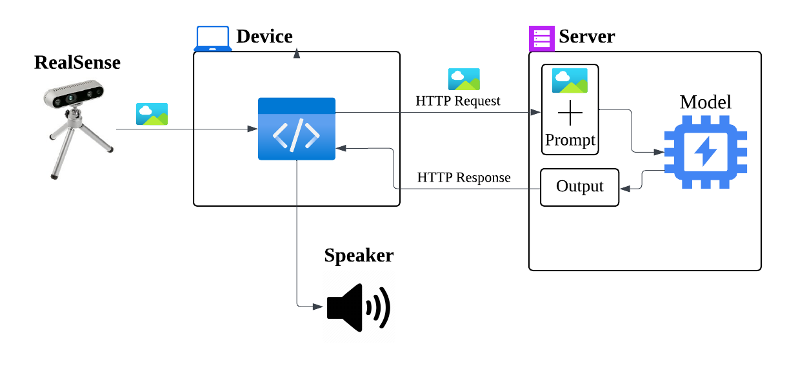

# OpenVINO Flask Server for Visual Assistance

This project is part of the **Industry-Academia Collaboration Program** between **Shanghai Jiao Tong University** and **Intel**. The goal is to build an intelligent real-time assistance system for visually impaired individuals by combining computer vision, multimodal language models, and OpenVINO acceleration.

> ⚠️ The project is under active development and not production-ready.

---

## 📌 Project Overview

This project aims to develop a **portable object recognition system** that helps visually impaired users perceive their surroundings through **real-time voice feedback**. By integrating **YOLO-based object detection**, **LLaVA (Large Vision-Language Model)**, **OpenVINO optimization**, and **Text-to-Speech (TTS)**, the system analyzes visual input and generates spoken descriptions of the environment.

---

## 🖼️ System Architecture

Here is a high-level diagram illustrating the complete process from image capture to voice feedback:



---

## 🧠 Tech Stack


---

## 🚀 Features & Architecture

### 🔍 Real-Time Visual Understanding

- Use **Intel RealSense** camera to capture RGB and **depth images**, providing spatial context like:

  - `"3 meters ahead: parked car"`
  - `"1 meter to the left: signpost"`

- Detect important objects like **stairs, crosswalks, bins**, etc., using a **YOLOv12n model** fine-tuned via **transfer learning**.

- Perform **real-time object detection** and semantic analysis using:
  - `YOLOv12n` (lightweight)
  - `Deepseek-VL`, `bc-zhou` multimodal models for language generation

### ⚡ Inference Acceleration

- Convert PyTorch models into **OpenVINO Intermediate Representation (IR)** format.
- Apply **INT8 static quantization** using **NNCF** to reduce latency.
- Achieved up to **5.5× speedup** in inference performance compared to unoptimized models.

### 🧠 Semantic Description via LLaVA

- Process image + object labels using **DeepSeek-VL** (based on LLaVA) to generate descriptive text like:

  > `"Caution! There is a dog in front of you. You can move right to avoid it."`

- Responses are **context-aware** and adaptive to prompt design.

### 🔊 Voice Feedback

- Integrate **Microsoft Edge TTS** to convert model-generated text into **clear speech output**.
- Delivered directly to the device for **offline audio playback**.

---

## 🌐 Server API

The server is built with **Flask** and deployed on **Featurize** with GPU support (RTX 4090, AMD EPYC CPU).

### `/process` Endpoint

- **Method**: `POST`
- **Input**: `multipart/form-data`
  - `image`: uploaded image
  - `text`: object name (e.g., "dog")
- **Response**:

```json
{
  "text": "Caution! There is a dog in front of you. You can move right to avoid it."
}
```

### Performance Benchmark

| Metric             | Value             |
| ------------------ | ----------------- |
| Mean Latency       | 1.179 sec         |
| Min/Max Latency    | 1.163 / 1.204 sec |
| Std Deviation      | 0.008 sec         |
| Requests < 1.5 sec | 100%              |

> 📈 The server remains responsive and stable under continuous load (50 requests tested).

---

## 🛠️ Development Progress

- ✅ Server operational in Ubuntu with Flask
- ✅ Deepseek-VL integrated for image-text generation
- ✅ OpenVINO acceleration for YOLOv12 and DeepSeek
- ✅ TTS output integrated for real-time voice assistance
- 🔄 Further optimization in progress (latency, deployment)

---

## 🔄 Future Plans

- Add **hardware integration** with edge cameras (e.g., embedded Jetson Nano or Raspberry Pi).
- Improve **prompt engineering** for better multimodal reasoning.
- Explore **TTS model optimization** for on-device synthesis.
- Expand custom dataset for **specialized objects** (e.g., elevators, escalators).

---

## 🧑‍💻 My Role

I was responsible for:

- Designing and building the **Flask server backend**.
- Integrating **LLaVA-based vision-language models**.
- Applying **OpenVINO optimizations** for inference speedup.
- Deploying the server in GPU environments (Featurize, AWS EC2).
- Testing and benchmarking system latency and reliability.

> 💡 _This system is designed to empower visually impaired individuals with intelligent real-time assistance, enhancing safety, awareness, and independence in everyday life._
